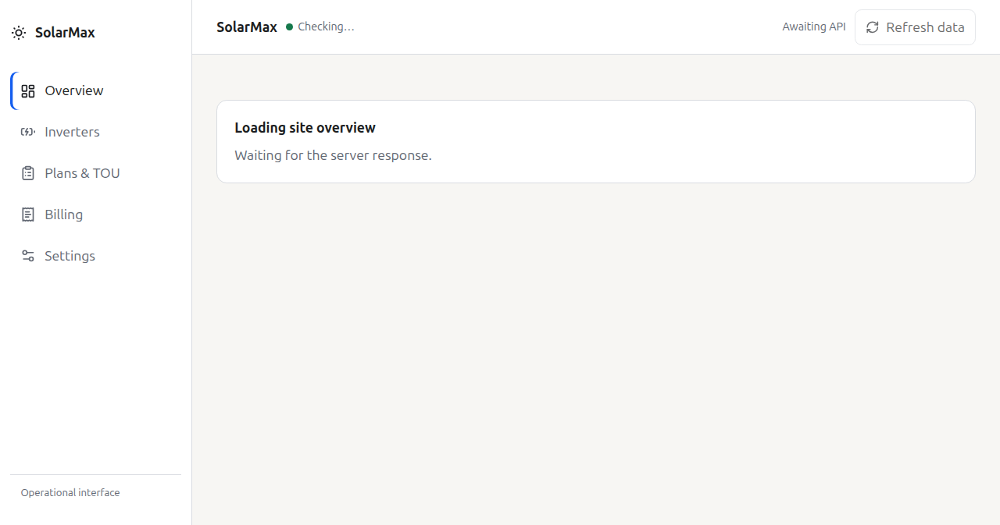

# Solarmax

Solarmax is a Dockerized solar optimisation dashboard for homes and small sites with one or more inverters, batteries, and TOU electricity plans.

## Overview



The screenshot shows the live React Overview dashboard, including current site
operations, energy totals, the daily net bill chart, and the current bill.

## What it includes

- Modern layered UI with 5 themes
- Live dashboard on port `9117`
- Inverter profile abstraction with a first-class **SigenStor EC 20.0 TP AU** profile
- Polling every 30 seconds by default
- 30-minute database rollups
- Power plan + import/export TOU configuration
- Current bill breakdown by day and TOU bracket
- Manual mode and AI mode
- MCP server for agent access to settings, live values, and recommendations

## Run with Docker

```bash
docker compose up --build
```

Then open:

- `http://localhost:9117`

## Web UI rollout

The compiled React UI is the default in the production image and Docker Compose. The legacy Jinja UI remains available as a compatibility fallback. Set `SOLARMAX_WEBUI_MODE=legacy` to restore the original pages without changing the database; `react` selects the rebuilt WebUI explicitly when needed. The switch affects only `/`, `/inverters`, `/plans`, `/billing`, and `/settings`; APIs, docs, and static assets keep their existing routes.

## Data storage

The app stores data in SQLite at:

- `/data/solarmax.db`

When using Docker Compose, that path is backed by the `solarmax-data` volume.

## MCP usage

The repository includes an MCP server entrypoint:

```bash
python -m solarmax.mcp_server
```

Recommended MCP tools expose:

- current settings
- inverter list and update actions
- power plan and TOU configuration
- live dashboard state
- weather-aware recommendations

For Hermes, wire it as a stdio MCP server in `~/.hermes/config.yaml` once you have the path you want to run from.

## Notes

- The first version reads live telemetry from the SigenStor over Modbus TCP. When the inverter is unreachable, all live values show "—" until it responds again — no simulated data is ever shown.
- The inverter profile/module design is intentionally pluggable so future inverter models can be added as separate modules.

## Versioning

The current release is recorded in [`VERSION`](VERSION) and follows Semantic
Versioning (`MAJOR.MINOR.PATCH`). Release history and upgrade notes are kept in
[`CHANGELOG.md`](CHANGELOG.md).
